# Домашнее задание к занятию «Работа с данными (DDL/DML)» Илларионов Дмитрий

---

Задание можно выполнить как в любом IDE, так и в командной строке.

### Задание 1

1.1. Поднимите чистый инстанс MySQL версии 8.0+. Можно использовать локальный сервер или контейнер Docker.

Поднял в докере:

```
services:

  mysql:
    image: mysql
    # NOTE: use of "mysql_native_password" is not recommended: https://dev.mysql.com/doc/refman/8.0/en/upgrading-from-previous-series.html#upgrade-caching-sha2-password
    # (this is just an example, not intended to be a production configuration)
    command: --default-authentication-plugin=mysql_native_password
    restart: always
    #env_file: .env
    environment:
      MYSQL_ROOT_PASSWORD: example
      MYSQL_USER: user
      MYSQL_PASSWORD: 12345
    ports:
      - 3306:3306
    volumes:
      - ./docker_volumes/mysql:/var/lib/mysql
    networks:
      docker-net:
```

На ВМ еще установил mysql-client

```
apt install -y mysql-client
```

На ВМ подложил файлы БД - дамп.
Сразу импортировал данные - создал БД:

```
mysql -p -h 127.0.0.1 -P 3306 -u root < sakila-db/sakila-schema.sql
mysql -p -h 127.0.0.1 -P 3306 -u root < sakila-db/sakila-data.sql
```

Посмотрел объекты в БД:

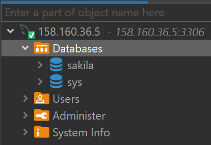

В DBeaver - это леко, еще через командную строку посмотрел:

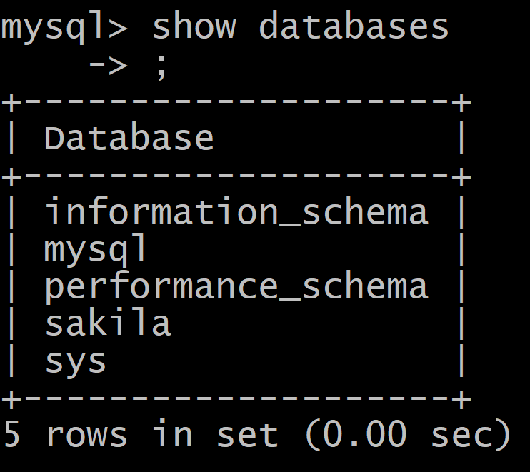

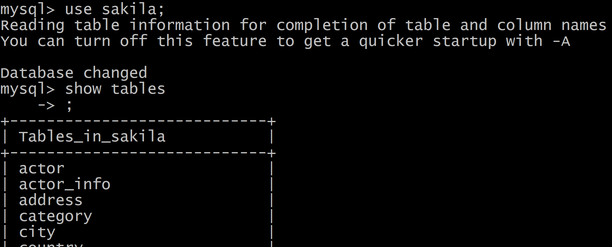

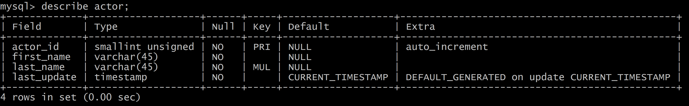

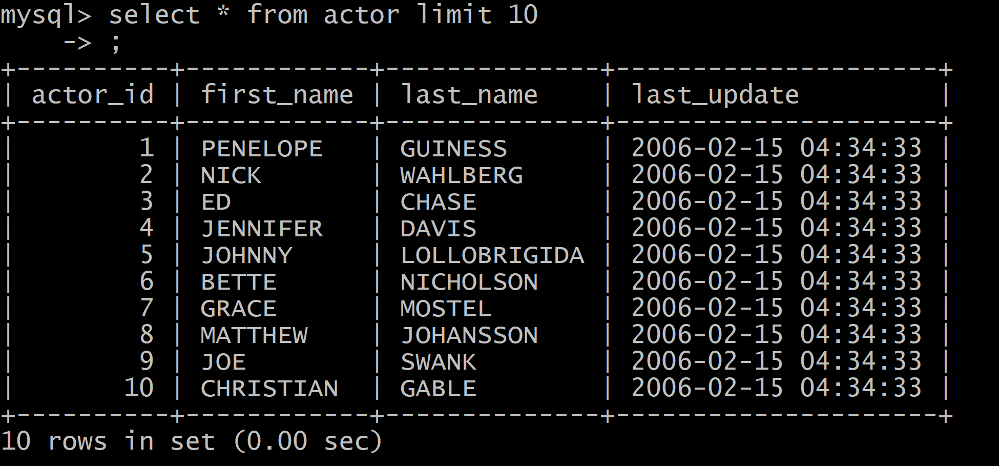

1.2. Создайте учётную запись sys_temp. 


Сначала так создал - но, это не заработало, т.к. в докере...
```
CREATE USER 'sys_temp'@'localhost' IDENTIFIED BY '12345';

```
Потом так создал:

```
CREATE USER 'sys_temp'@'172.18.0.1' IDENTIFIED BY '12345';
```


1.3. Выполните запрос на получение списка пользователей в базе данных. (скриншот)

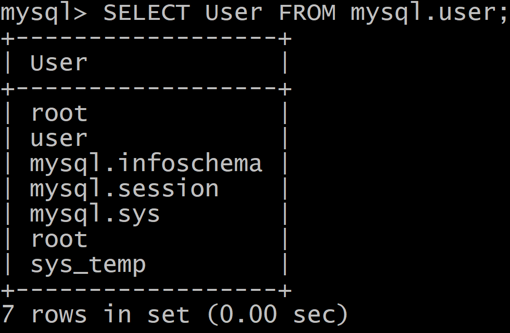

поесле пересоздания пользователя:

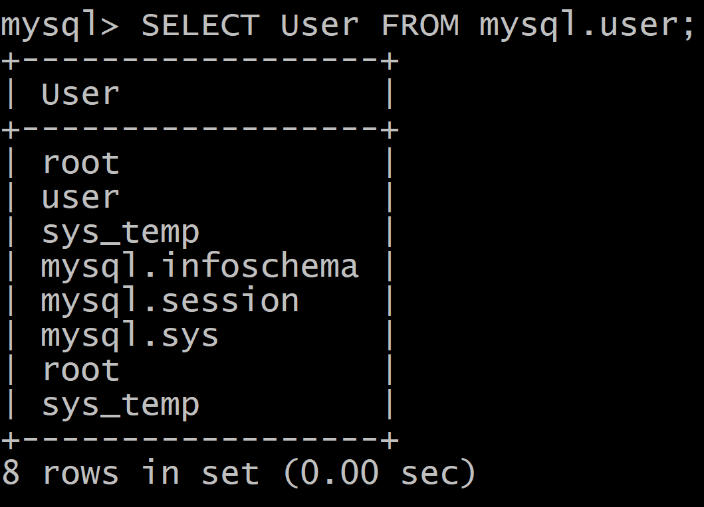

```
SELECT User FROM mysql.user;
```

1.4. Дайте все права для пользователя sys_temp. 

```
mysql> GRANT ALL PRIVILEGES ON *.* TO 'sys_temp'@'localhost';
```

```
mysql> GRANT ALL PRIVILEGES ON *.* TO 'sys_temp'@'172.18.0.1';
```


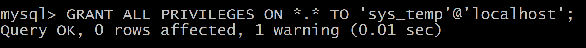

1.5. Выполните запрос на получение списка прав для пользователя sys_temp. (скриншот)

```
mysql> show grants for 'sys_temp'@'localhost';
```

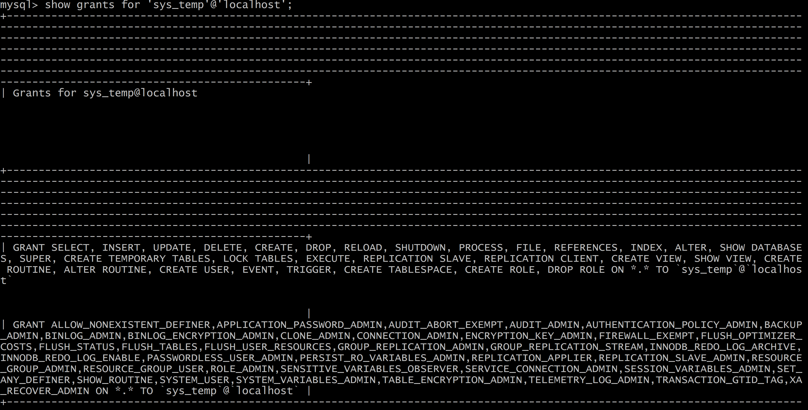

```
mysql> show grants for 'sys_temp'@'172.18.0.1';
```

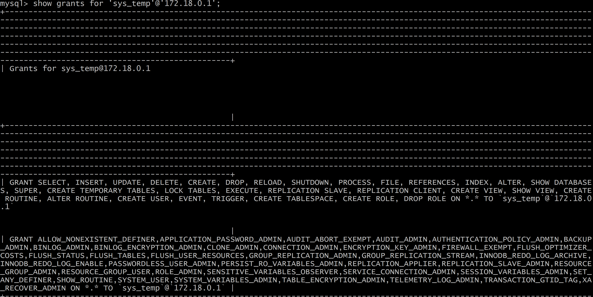

1.6. Переподключитесь к базе данных от имени sys_temp.

Сначала пробовал подключиться через командную строку:
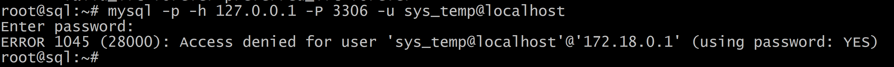

в дебивере аналогично, только еще я настроил опции в драйвере:

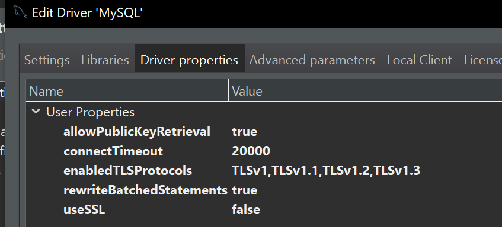

Видимо не хватает грантов.

https://stackoverflow.com/questions/40680621/error-1045-28000-access-denied-for-user-using-password-yes

После создания второго пользователя с адресом ip докера:

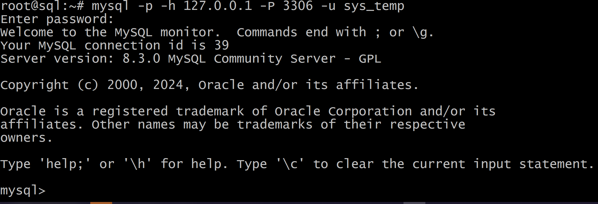

```
root@sql:~# mysql -p -h 127.0.0.1 -P 3306 -u sys_temp
```

Для смены типа аутентификации с sha2 используйте запрос: 
```sql
ALTER USER 'sys_test'@'localhost' IDENTIFIED WITH mysql_native_password BY 'password';
```


```
ALTER USER 'sys_temp'@'172.18.0.1' IDENTIFIED WITH mysql_native_password BY '12345';
```


1.6. По ссылке https://downloads.mysql.com/docs/sakila-db.zip скачайте дамп базы данных.

1.7. Восстановите дамп в базу данных.

Выполнил уже в самом начале.

1.8. При работе в IDE сформируйте ER-диаграмму получившейся базы данных. При работе в командной строке используйте команду для получения всех таблиц базы данных. (скриншот)

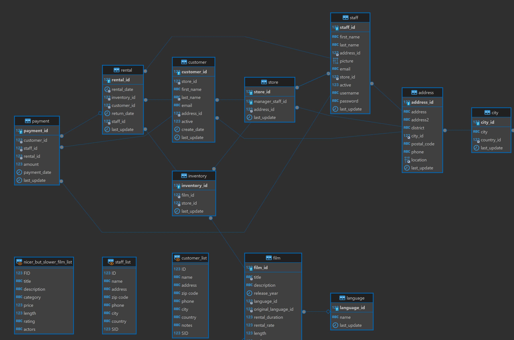

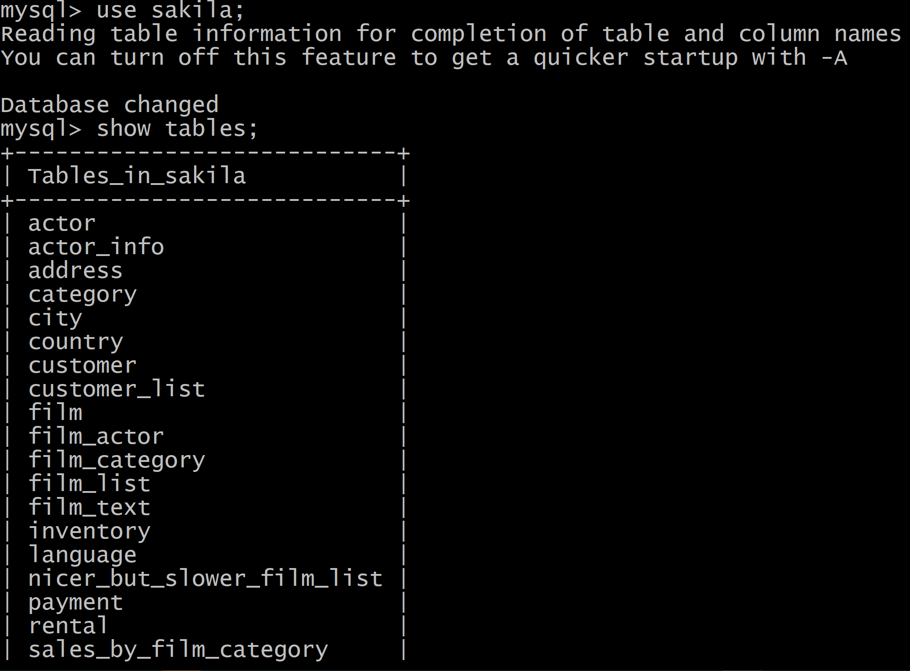

*Результатом работы должны быть скриншоты обозначенных заданий, а также простыня со всеми запросами.*


### Задание 2
Составьте таблицу, используя любой текстовый редактор или Excel, в которой должно быть два столбца: в первом должны быть названия таблиц восстановленной базы, во втором названия первичных ключей этих таблиц. Пример: (скриншот/текст)

```
Название таблицы | Название первичного ключа
customer         | customer_id
```

Составлять таблицу не вижу смысла - трата времени, т.к. вся информация есть на диаграмме:

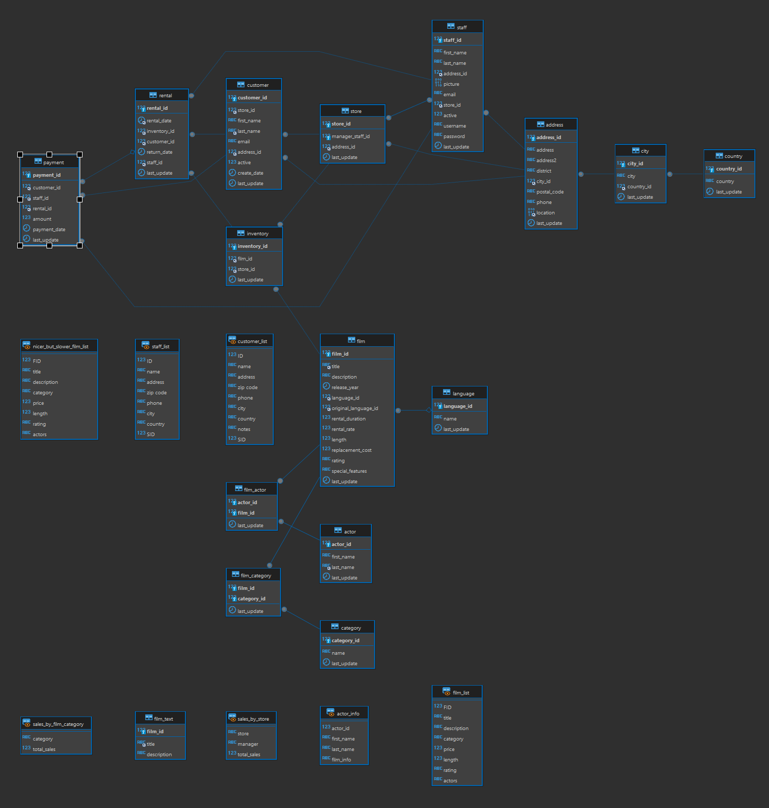

Например таблица:

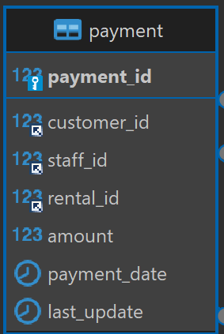

для нее примари кей:
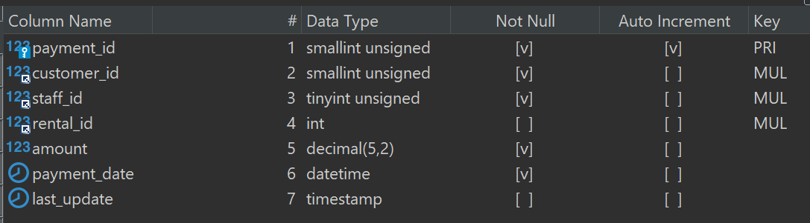

payment_id  - первая строка - колонка.

Аналогично и у других таблиц.

Только у некоторых таблиц составной примари кей:

film_actor

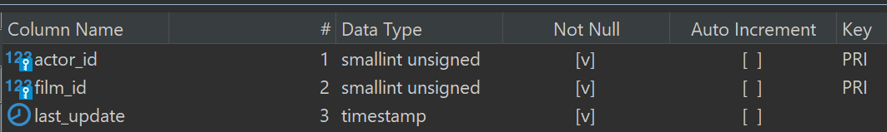

film_category

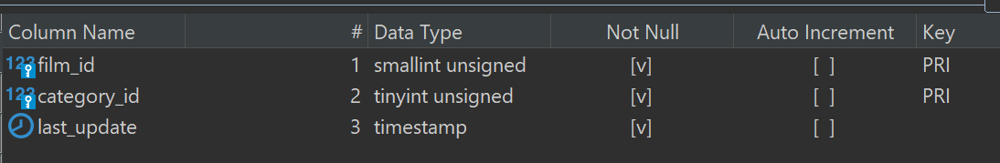


## Дополнительные задания (со звёздочкой*)
Эти задания дополнительные, то есть не обязательные к выполнению, и никак не повлияют на получение вами зачёта по этому домашнему заданию. Вы можете их выполнить, если хотите глубже шире разобраться в материале.

### Задание 3*
3.1. Уберите у пользователя sys_temp права на внесение, изменение и удаление данных из базы sakila.

```
mysql> REVOKE  INSERT ON *.* FROM 'sys_temp'@'172.18.0.1';
mysql> REVOKE  DELETE, UPDATE ON *.* FROM 'sys_temp'@'172.18.0.1';
```

3.2. Выполните запрос на получение списка прав для пользователя sys_temp. (скриншот)

```
 show grants for 'sys_temp'@'172.18.0.1';
```


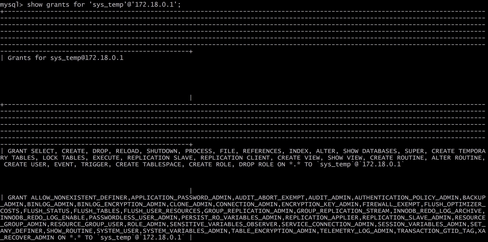

*Результатом работы должны быть скриншоты обозначенных заданий, а также простыня со всеми запросами.*


